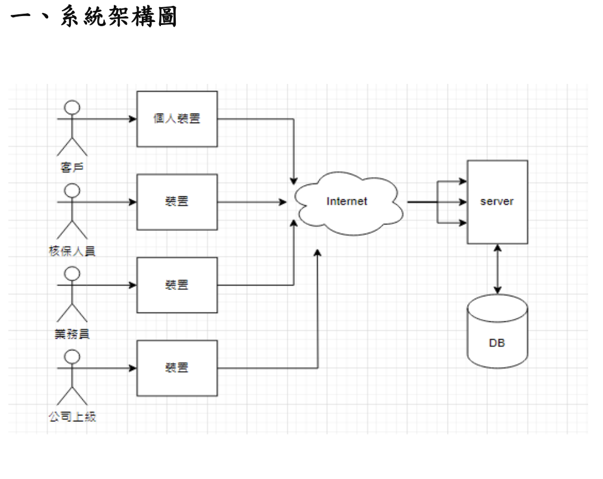
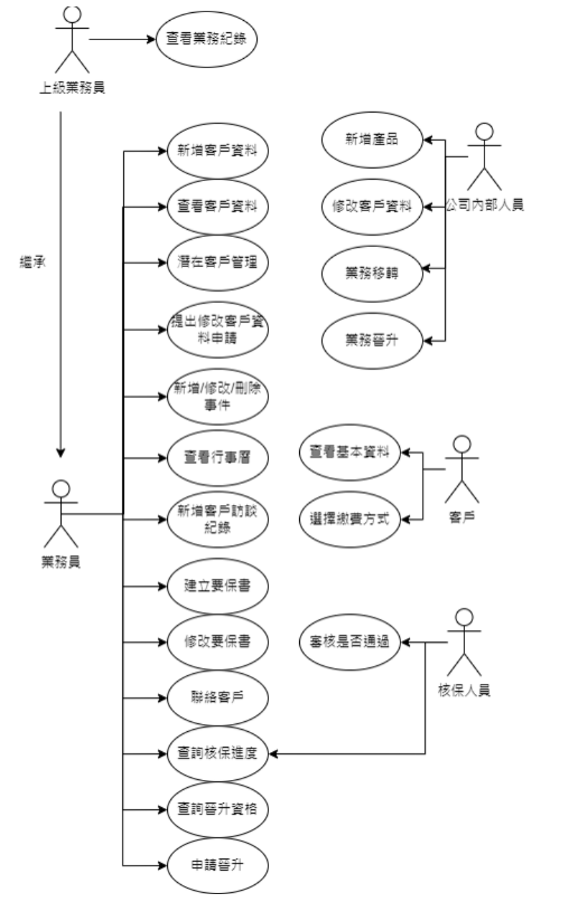
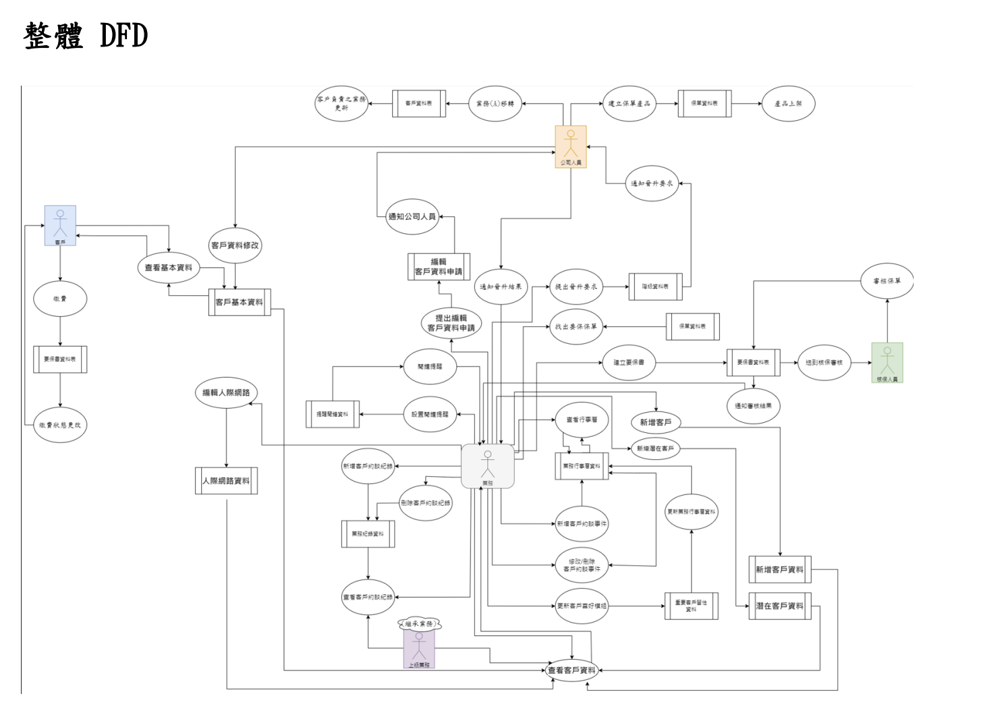
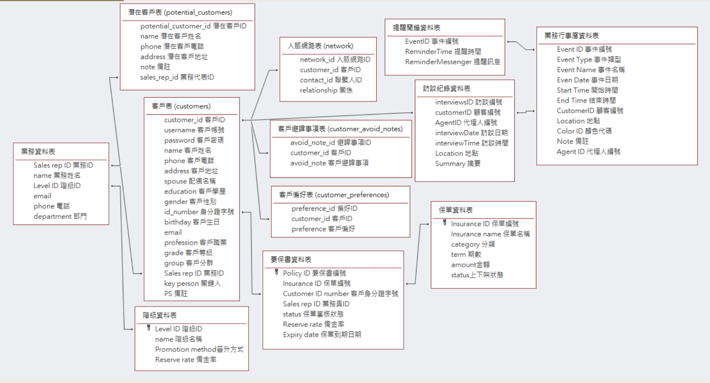
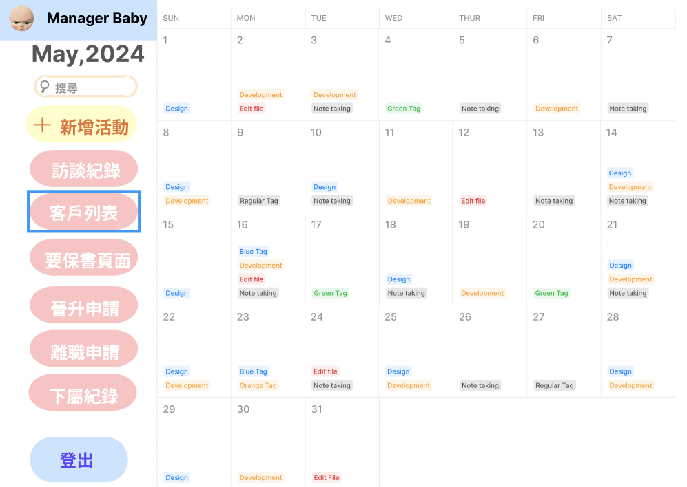
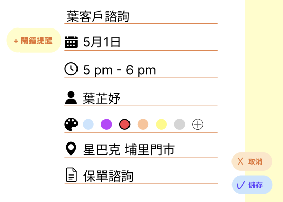
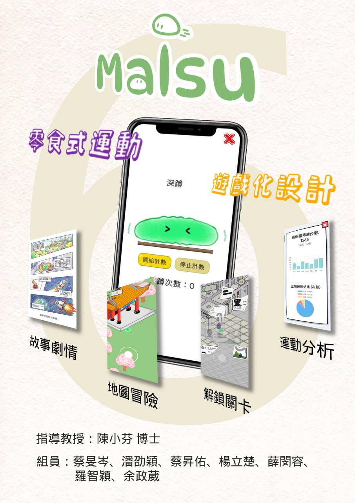
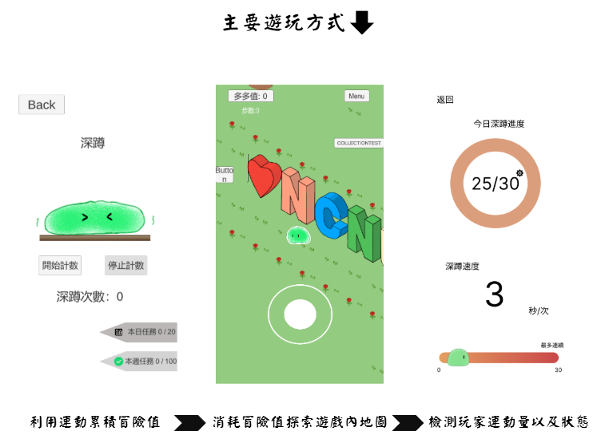

# 嗨，我是薛閔容 Min-Jung Hsueh 👋

> 資訊管理學系 · 對新技術與系統開發充滿熱忱的大學生

---

## 🙋 關於我

就讀**資訊管理學系**，具備系統架構設計、後端開發與資料庫設計實作經驗。  
對 **生成式 AI、雲端運算、RAG 技術** 有濃厚興趣，喜歡把新技術轉化成實際可運作的系統。

目前積極尋求**暑期實習機會**，希望在實務環境中持續學習與成長。

---

## 🛠 技術能力

**後端 & 系統**  

**資料庫**  

**AI & 雲端**  

**設計 & 分析**  

---

## 🚀 專案作品

---

### 📋 保險管理系統 · 系統分析與設計
> 課程專題 | 系統分析與設計 · 1122學期

以保險公司業務管理為核心，進行完整的系統分析與設計，涵蓋需求訪談、UML 建模、資料庫設計至 UI Prototype。

**系統架構**

多角色架構設計，支援客戶、業務員、核保人員、公司上級四種角色，透過 Internet 連接至統一 Server 與資料庫。

**使用案例分析**

完整的 Use Case 分析，涵蓋業務員、上級業務員、核保人員、客戶、公司內部人員五種角色的功能需求。

**資料流程圖（DFD）**

整體 DFD 呈現各角色與系統間的資料流動關係，包含業務、客戶、公司人員、核保人員之間的互動流程。

**資料庫設計**

設計 10+ 張資料表，包含客戶表、業務資料表、要保書資料表、保單資料表、訪談紀錄資料表等，並定義完整的外鍵關聯。

**UI Prototype**

以 Figma 設計完整 UI Prototype，包含行事曆、客戶列表、要保書、晉升申請等頁面。

🔗 **[查看 Figma Prototype](https://www.figma.com/proto/vCFZ8nvaJR07v2F4QrN5PW/SAD-%E6%95%B4%E5%90%88?node-id=0-1&t=NR7vkOkcLwLvQ2pw-1)**

**技術與工具**  
`系統分析` `UML` `DFD` `ERD` `資料庫設計` `Figma` `使用者需求訪談`

---

### 🎯 零食式運動遊戲設計

本專題旨在開發一款結合「零食式運動」與「遊戲化設計」，並強調「由線下到線上」整合體驗的數位互動遊戲《馬伊蘇大冒險（MaISu Adventure）》，針對現代人久坐、時間零碎與缺乏運動動機等問題，提出以低門檻、高趣味性為核心的數位解決方案。系統開發上，前端採用 Unity 6 引擎建構 2.5D Isometric 場景，後端以 Node.js 與 MySQL 搭建資料架構，技術亮點在於團隊利用 Android Studio 開發原生動態感測演算法，並封裝為 .aar 函式庫與 Unity 介接，實現精準的深蹲與開合跳動作識別。

 在遊戲內我們以右圖畫面中名為''Maisu''的主角來帶領著使用者探索地圖，以三大運動核心走路、深蹲、開合跳讓使用者透過拿著手機做運動來累積遊戲中的冒險點數，在遊戲中使用這些點數來探索整個地圖。

 

 
### 🔍 RAG 知識問答系統
> 上傳文件 → 向量索引 → 自然語言問答，完全本地端運行

- 技術：`Python` `Flask` `LlamaIndex` `Ollama llama3.2`
- 特色：不需 API Key，本地 LLM 驅動，支援 PDF / TXT / MD 文件
- [→ 查看程式碼](https://github.com/Peter930427/rag-qa)

---

### 📰 新聞摘要機器人
> 自動爬取多個新聞來源，AI 生成繁體中文摘要

- 技術：`Python` `Flask` `BeautifulSoup4` `RSS Feed` `Ollama`
- 特色：同時爬取 BBC 中文、科技新報、iThome 等來源，逐篇 AI 摘要
- [→ 查看程式碼](https://github.com/Peter930427/news-digest)

---

## 📈 GitHub Stats

---

## 📫 聯絡我

| 管道 | 連結 |
|------|------|
| 🌐 個人網站 | [Peter930427.github.io/my-web](https://Peter930427.github.io/my-web) |
| 📧 Email | [your@email.com](mailto:your@email.com) |
| 💼 LinkedIn | [linkedin.com/in/your-profile](https://linkedin.com/in/your-profile) |
| 📸 Instagram | [@your-handle](https://instagram.com/your-handle) |

---

  <i>「對技術保持好奇，對學習保持開放。」</i>

