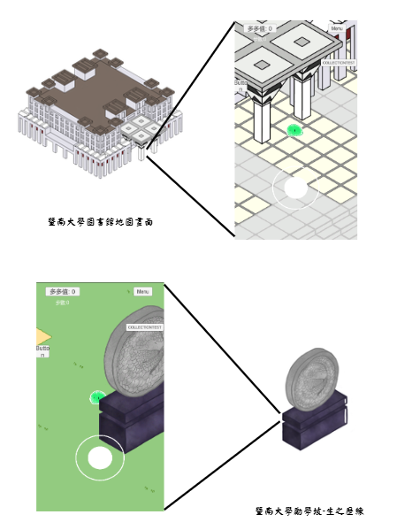

# 嗨，我是薛閔容 Min-Jung Hsueh 👋

> 資訊管理學系 · 對新技術與系統開發充滿熱忱的大學生

---

## 🙋 關於我

就讀**資訊管理學系**，具備系統架構設計、後端開發與資料庫設計實作經驗。  
對 **生成式 AI、雲端運算、遊戲開發** 有濃厚興趣，喜歡把新技術轉化成實際可運作的系統。

目前積極尋求**暑期實習機會**，希望在實務環境中持續學習與成長。

---

## 🛠 技術能力

**後端 & 系統**  

**資料庫**  

**AI & 雲端**  

**設計 & 分析**  

---

## 🚀 專案作品

---

### 📋 保險管理系統 · 系統分析與設計
> 課程專題 | 系統分析與設計 · 1122學期

以保險公司業務管理為核心，進行完整的系統分析與設計，涵蓋需求訪談、UML 建模、資料庫設計至 UI Prototype。

**系統架構**

多角色架構設計，支援客戶、業務員、核保人員、公司上級四種角色，透過 Internet 連接至統一 Server 與資料庫。

**使用案例分析**

完整的 Use Case 分析，涵蓋業務員、上級業務員、核保人員、客戶、公司內部人員五種角色的功能需求。

**資料流程圖（DFD）**

整體 DFD 呈現各角色與系統間的資料流動關係，包含業務、客戶、公司人員、核保人員之間的互動流程。

**資料庫設計**

設計 10+ 張資料表，包含客戶表、業務資料表、要保書資料表、保單資料表、訪談紀錄資料表等，並定義完整的外鍵關聯。

**UI Prototype**

以 Figma 設計完整 UI Prototype，包含行事曆、客戶列表、要保書、晉升申請等頁面。

🔗 **[查看 Figma Prototype](https://www.figma.com/proto/vCFZ8nvaJR07v2F4QrN5PW/SAD-%E6%95%B4%E5%90%88?node-id=0-1&t=NR7vkOkcLwLvQ2pw-1)**

`系統分析` `UML` `DFD` `ERD` `資料庫設計` `Figma`

---

### 🎯 馬伊蘇大冒險 · 零食式運動遊戲
> 課程專題 | Unity 2.5D Isometric 手機遊戲

結合「零食式運動」與「遊戲化設計」的數位互動遊戲，針對現代人久坐、時間零碎的問題，以低門檻高趣味性為核心。利用 Android Studio 開發原生動態感測演算法，封裝為 `.aar` 函式庫與 Unity 介接，實現精準的深蹲與開合跳動作識別。

以暨南國際大學為地圖場景，玩家透過拿著手機做運動（走路、深蹲、開合跳）累積冒險點數，探索整個地圖。

`Unity 6` `C#` `Android Studio` `Node.js` `MySQL` `2.5D Isometric`

---

### ☁️ 虛擬化、Container 與 Kubernetes 技術研究筆記
> 自學研究 | 雲端基礎設施底層原理 · 從虛擬化到容器編排

深入研究現代雲端基礎設施的完整技術棧，從底層虛擬化原理一路向上，涵蓋 Container 隔離機制、Docker 架構，直到 Kubernetes 容器編排實作。

**研究主題包含：**

- **虛擬化底層**：Hypervisor Type 1/2、KVM、QEMU 動態二進位翻譯（DBT / TCG）
- **CPU 虛擬化**：Ring 架構、Full Emulation / Para-virtualization / Hardware-Assisted 三種解法
- **記憶體 & 儲存虛擬化**：MMU、三層地址轉換（GVA → GPA → HPA）、overlayfs Copy-on-Write
- **網路虛擬化**：SDN、VXLAN Overlay、OVS（Open vSwitch）
- **Linux Namespace**：PID / Net / Mount / UTS / IPC / User 六種隔離機制深度解析
- **cgroup v1 / v2**：CPU、Memory、I/O 資源控制與 OOM Killer 機制
- **Docker 完整架構**：dockerd → containerd → runc → overlayfs 啟動流程
- **Container 安全機制**：seccomp syscall 過濾、Capabilities 最小權限、AppArmor / SELinux
- **MicroVM**：Firecracker 架構、Kata Containers、Serverless 應用場景
- **Kubernetes**：使用 Kind 建立本地 Cluster，實作 Pod 部署與服務管理

🔗 **[查看完整筆記（HackMD）](https://hackmd.io/@Z7oAeeHoQUyhHQ_okf3Pjw/H1ywEnIqbl)**

`虛擬化` `KVM` `QEMU` `Docker` `Linux Namespace` `cgroup` `MicroVM` `Kubernetes`

---

## 📈 GitHub Stats

---

## 📫 聯絡我

| 管道 | 連結 |
|------|------|
| 🌐 個人網站 | [peter930427.github.io/my-web](https://peter930427.github.io/my-web/portfolio/) |
| 📧 Email | [skrmeaning@gmail.com](mailto:skrmeaning@gmail.com) |
| 📸 Instagram | [@xue_minrong](https://www.instagram.com/xue_minrong) |

---

  <i>「對技術保持好奇，對學習保持開放。」</i>

