

# 您好，我是薛閔容 Min-Jung Hsueh 👋

**國立中正大學 資訊管理學系醫療資訊管理碩士班 · 對新技術與系統開發充滿熱忱**

 

## 🙋 關於我

歡迎瀏覽我的作品集 👀

我畢業於**國立暨南國際大學資訊管理學系**，目前就讀**國立中正大學資訊管理學系醫療資訊管理碩士班**。平常喜歡自己動手把一個想法從零蓋成一個真的能跑的系統——從畫 UML、設計資料庫，到寫後端邏輯，每個環節都想搞懂原理而不只是會用。這份好奇心也讓我在課堂之外一頭栽進 **Kubernetes、虛擬化底層原理**，想知道那些平常用得理所當然的雲端服務，到底是怎麼被組出來的。

我也喜歡把技術用在好玩的地方，像是把「運動」設計成遊戲機制，讓原本枯燥的深蹲、開合跳變成闖關動力。這個資料夾收錄的是我這幾年做過、覺得值得拿出來分享的專案與學習紀錄，如果你對某個項目有興趣或想聊聊，歡迎透過下方的聯絡方式找我 🙌

 

## 🛠 技術能力

**後端 & 系統**

**資料庫**

**AI & 雲端**

**設計 & 分析**

 

## 🚀 專案作品

### 📋 保險管理系統 · 系統分析與設計
> 課程專題 | 系統分析與設計 · 1122學期

以保險公司業務管理為核心，進行完整的系統分析與設計，涵蓋需求訪談、UML 建模、資料庫設計至 UI Prototype。

<table>
<tr>
<td width="50%"><b>系統架構</b> 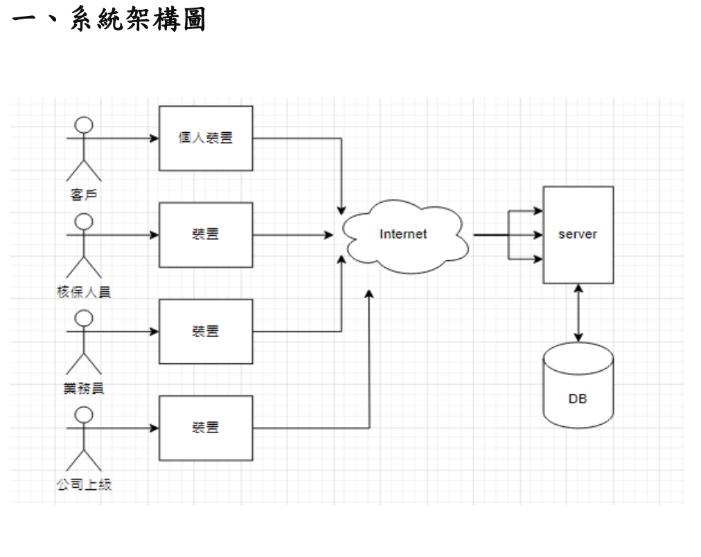</td>
<td width="50%"><b>使用案例分析</b> 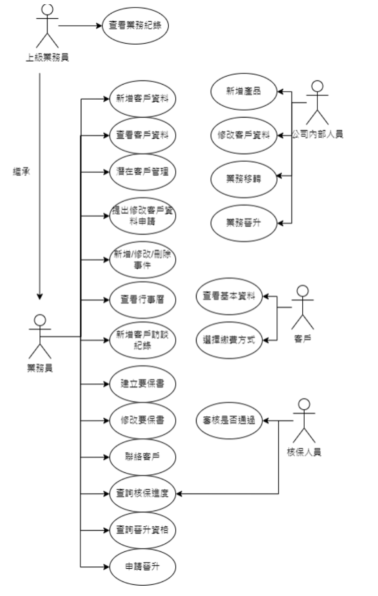</td>
</tr>
<tr>
<td width="50%"><b>資料流程圖（DFD）</b> 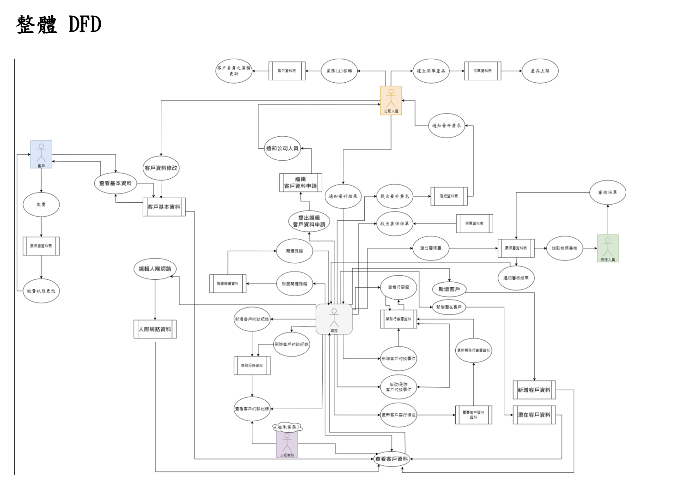</td>
<td width="50%"><b>資料庫設計（ERD）</b> 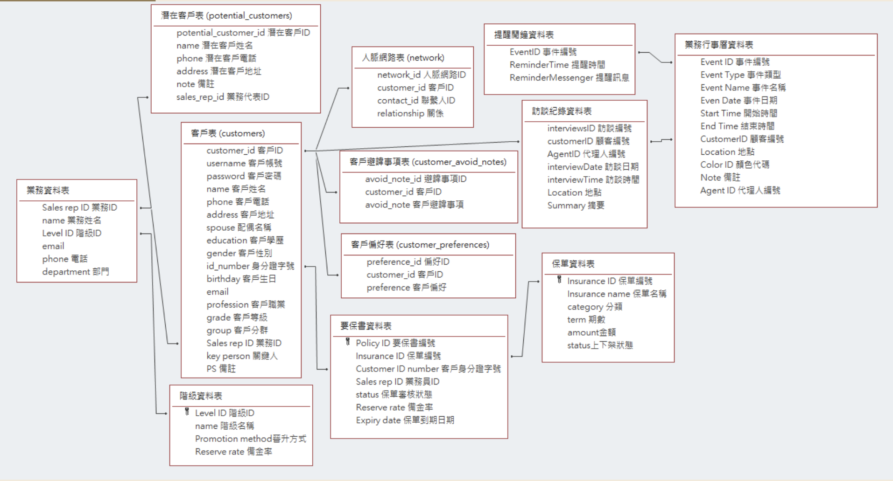</td>
</tr>
</table>

多角色架構設計，支援客戶、業務員、核保人員、公司上級四種角色；完整 Use Case 涵蓋五種角色的功能需求；DFD 呈現各角色與系統間的資料流動；資料庫設計 10+ 張資料表並定義完整外鍵關聯。

**UI Prototype**

<table>
<tr>
<td width="50%">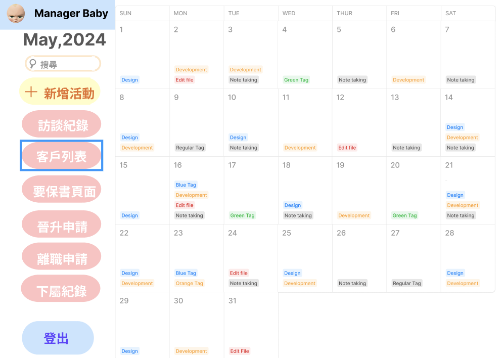
行事曆
</td>
<td width="50%">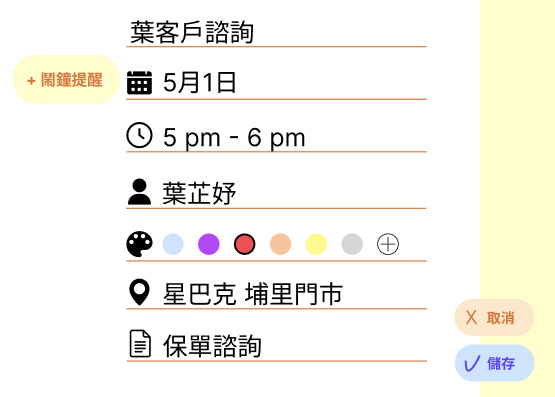
新增活動
</td>
</tr>
</table>

以 Figma 設計完整 UI Prototype，包含行事曆、客戶列表、要保書、晉升申請等頁面。

🔗 **[查看 Figma Prototype](https://www.figma.com/proto/vCFZ8nvaJR07v2F4QrN5PW/SAD-%E6%95%B4%E5%90%88?node-id=0-1&t=NR7vkOkcLwLvQ2pw-1)**

`系統分析` `UML` `DFD` `ERD` `資料庫設計` `Figma`

---

### 🎯 馬伊蘇大冒險 · 零食式運動遊戲
> 課程專題 | Unity 2.5D Isometric 手機遊戲 · **南投縣黑客松大學組入選**

結合「零食式運動」與「遊戲化設計」的數位互動遊戲，針對現代人久坐、時間零碎的問題，以低門檻高趣味性為核心。利用 Android Studio 開發原生動態感測演算法，封裝為 `.aar` 函式庫與 Unity 介接，實現精準的深蹲與開合跳動作識別。

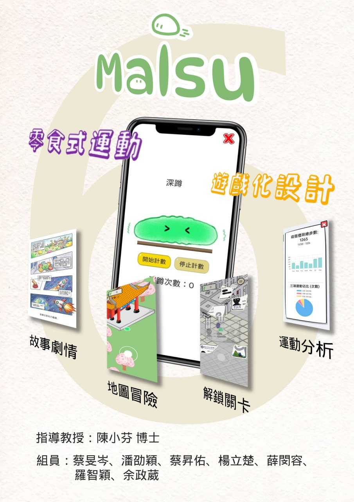

以暨南國際大學為地圖場景，玩家透過拿著手機做運動（走路、深蹲、開合跳）累積冒險點數，探索整個地圖。

<table>
<tr>
<td width="50%">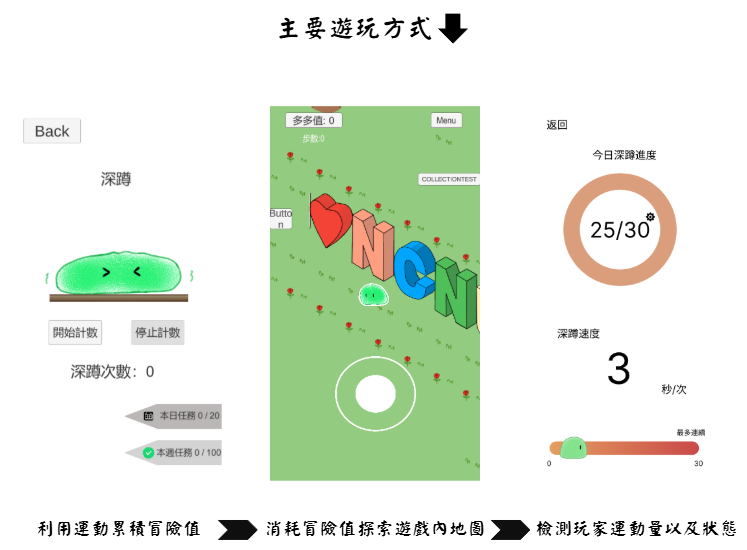
遊玩方式
</td>
<td width="50%">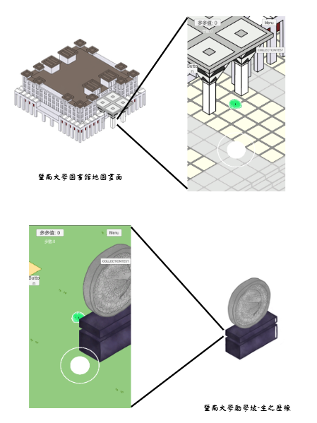
暨大場景對照
</td>
</tr>
</table>

`Unity 6` `C#` `Android Studio` `Node.js` `MySQL` `2.5D Isometric`

---

### ☁️ 虛擬化、Container 與 Kubernetes 技術研究筆記
> 自學研究 | 雲端基礎設施底層原理 · 從虛擬化到容器編排

深入研究現代雲端基礎設施的完整技術棧，從底層虛擬化原理一路向上，涵蓋 Container 隔離機制、Docker 架構，直到 Kubernetes 容器編排實作。

**研究主題包含：**

- **虛擬化底層**：Hypervisor Type 1/2、KVM、QEMU 動態二進位翻譯（DBT / TCG）
- **CPU 虛擬化**：Ring 架構、Full Emulation / Para-virtualization / Hardware-Assisted 三種解法
- **記憶體 & 儲存虛擬化**：MMU、三層地址轉換（GVA → GPA → HPA）、overlayfs Copy-on-Write
- **網路虛擬化**：SDN、VXLAN Overlay、OVS（Open vSwitch）
- **Linux Namespace**：PID / Net / Mount / UTS / IPC / User 六種隔離機制深度解析
- **cgroup v1 / v2**：CPU、Memory、I/O 資源控制與 OOM Killer 機制
- **Docker 完整架構**：dockerd → containerd → runc → overlayfs 啟動流程
- **Container 安全機制**：seccomp syscall 過濾、Capabilities 最小權限、AppArmor / SELinux
- **MicroVM**：Firecracker 架構、Kata Containers、Serverless 應用場景
- **Kubernetes**：使用 Kind 建立本地 Cluster，實作 Pod 部署與服務管理

🔗 **[查看完整筆記（HackMD）](https://hackmd.io/@Z7oAeeHoQUyhHQ_okf3Pjw/H1ywEnIqbl)**

`虛擬化` `KVM` `QEMU` `Docker` `Linux Namespace` `cgroup` `MicroVM` `Kubernetes`

 

## 🏆 證書與獲獎

| 類別 | 項目 | 單位 | 時間 |
|------|------|------|------|
| 🌐 英文能力 | Oxford Placement Test · **B2（整體）/ C1（英文運用）** | Oxford University Press | 2023.12 |
| 🎓 學程認證 | 軟體開發人才養成**學分學程**結業證書 | 國立暨南國際大學 | 2025.06 |
| 🏅 競賽入選 | **南投縣黑客松**大學組入選 — 馬伊蘇大冒險 | 南投縣政府 | 2025 |
| 🤖 AI 研習 | AI 創意實作：探索南投的廉能未來 結訓證書 | 南投縣政府 | 2025.07 |
| 🔒 資安培訓 | 教育部先進資通安全實務人才培育計畫 — **2024 中區資安體驗營** | 教育部 / AIS3 CLUB | 2024.10 |
| 📋 產學合作 | 日月潭觀光旅遊網站內容檢視計畫 — **交通部觀光署正式委託** | 交通部觀光署 | 2025 |
| 🤖 AI 能力鑑定 | 經濟部產業人才能力鑑定 — **AI應用規劃師初級能力鑑定** | 經濟部 / 工業技術研究院 | 2026.09 |
| 🐧 Linux 認證 | Linux Unhatched 結業證書 | Cisco Networking Academy / NDG | 2026.08 |

<table>
<tr>
<td width="50%">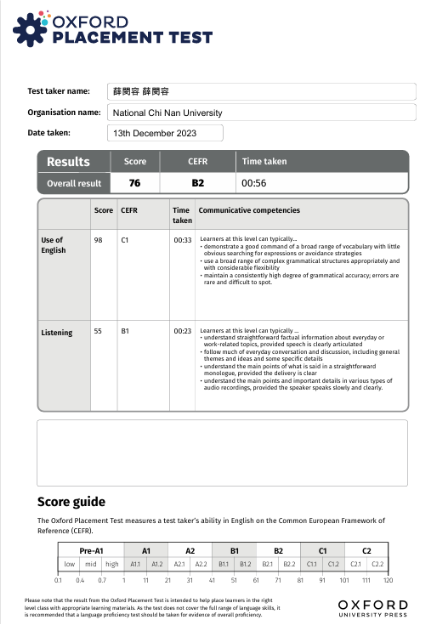
Oxford Placement Test
</td>
<td width="50%">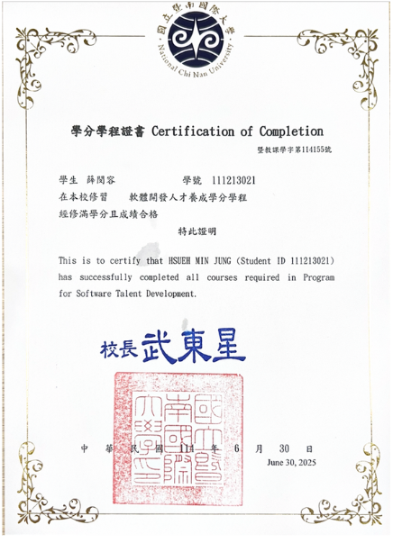
軟體開發學分學程結業證書
</td>
</tr>
<tr>
<td width="50%">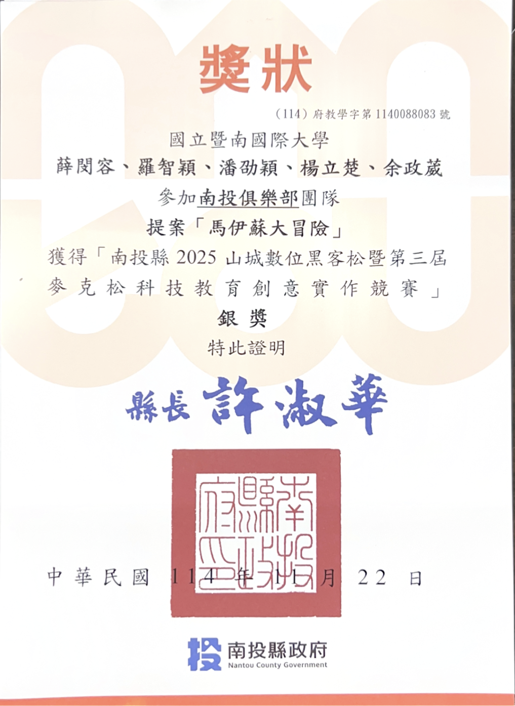
南投縣黑客松入選
</td>
<td width="50%">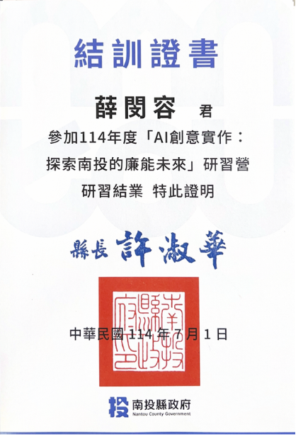
AI 創意實作結訓證書
</td>
</tr>
<tr>
<td width="50%">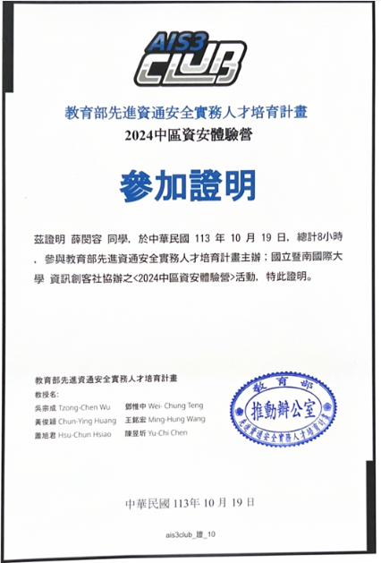
2024 中區資安體驗營
</td>
<td width="50%">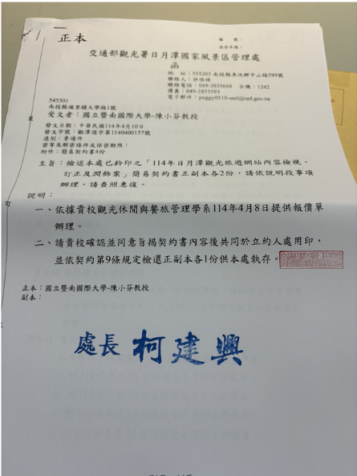
日月潭觀光旅遊網站產學合作
</td>
</tr>
<tr>
<td width="50%">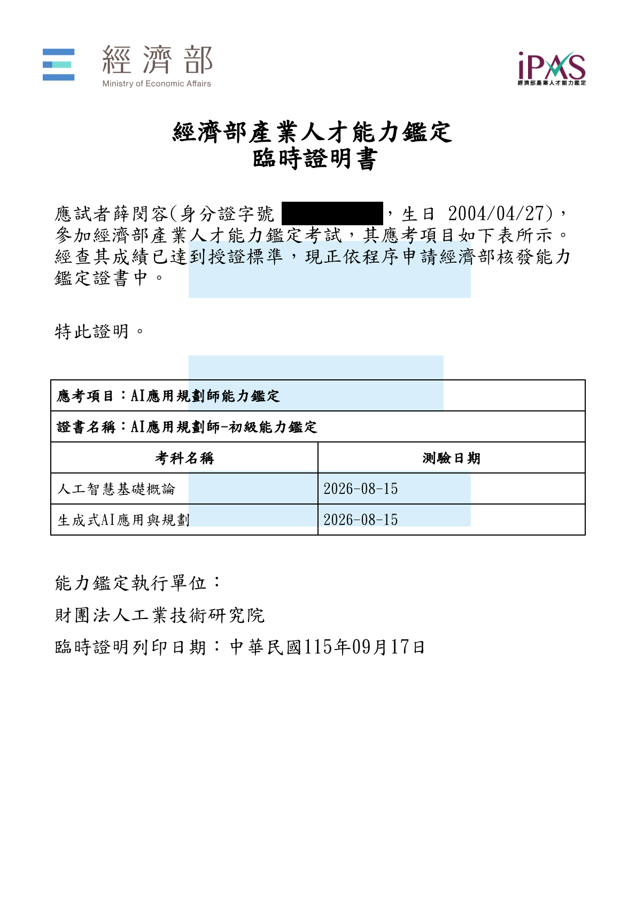
AI 應用規劃師初級能力鑑定
</td>
<td width="50%">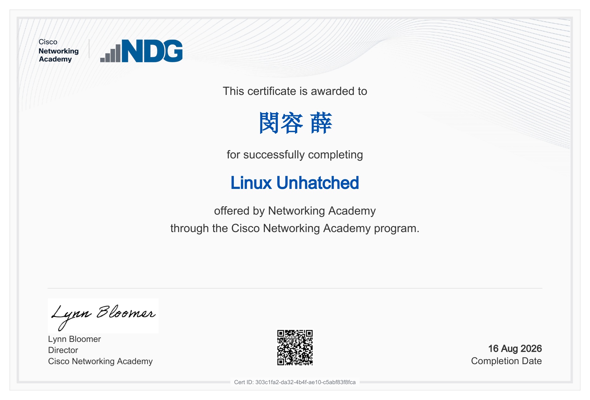
Linux Unhatched 結業證書
</td>
</tr>
</table>

 

## 📫 聯絡我

| 管道 | 連結 |
|------|------|
| 🌐 個人網站 | [peter930427.github.io/my-web](https://peter930427.github.io/my-web/portfolio/) |
| 📧 Email | [skrmeaning@gmail.com](mailto:skrmeaning@gmail.com) |
| 📸 Instagram | [@xue_minrong](https://www.instagram.com/xue_minrong) |

